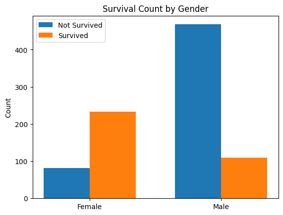

# IDS 706 Data Engineering Week 9 Mini Project

Gavin Li `gl183`

## Purpose of the project

The purpose of this week's mini project is to perform data manipulation in a cloud based environment, specifically Google Colab.

## Google Colab

[Here is the link for my Jupyter Notebook file](https://colab.research.google.com/drive/1AX91nExsTbxolOcUMSG3dFysssKby7oF)

## Data manipulation and visualization

The dataset used in this project is the kaggle Titanic training dataset.

The dataset is grouped by gender, then a mean of survived variable is calculated for each group to compare the survival rate.

A plot is then made to visualize the survival rate.

Here is the plot

## Result of `make format`, `make lint`, and `make test`